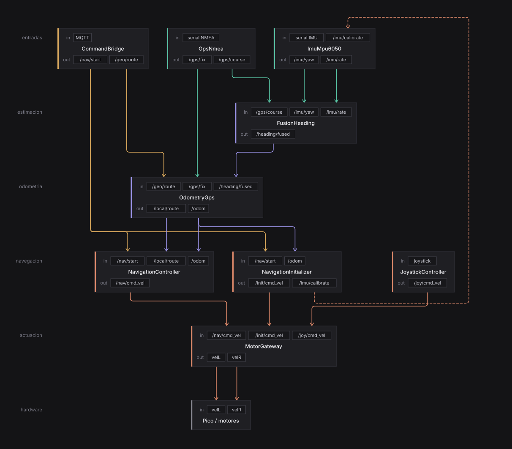

# Arquitectura — buey_robot

Navegacion autonoma de un skid-steer agricola (Buey V) en ROS2 Humble. Las reglas de diseño
(capas, nomenclatura, patrones) estan en [CONVENTIONS.md](CONVENTIONS.md); aca va el MAPA.

Principio: cada capa habla un vocabulario; la conversion lat/lon <-> x/y ocurre en UN solo
nodo (`OdometryGps`); arriba de esa frontera todo es x/y metrico.

<!-- graph:start -->

> Generado por `docs/graph/`. No editar a mano: se pisa en el proximo
> `npm run build`. Para cambiar el diagrama se edita `docs/graph/graph.spec.json`.



<!-- graph:end -->

## Nodos

Entradas y salidas de cada nodo estan en el diagrama de arriba (los cables). Aca, que hace cada uno.

| Archivo | Clase / nodo | Que hace |
|---|---|---|
| `drivers/gps_nmea.py` | `GpsNmea` | lee el GPS: lat/lon + calidad RTK; COG solo si confiable |
| `drivers/imu_mpu6050.py` | `ImuMpu6050` | bias del gyro + integra yaw relativo |
| `fusion/heading.py` | `FusionHeading` | fusiona gyro+COG -> yaw absoluto ENU; publica solo al converger |
| `odometry/gps.py` | `OdometryGps` (**bilingue**) | fija el datum; fix -> /odom (lever-arm x/y + filtro, solo si confiable); ruta geo -> x/y; pos lat/lon |
| `navigation/controller.py` | `NavigationController` | sigue la ruta (stop_and_turn, delega a `control/`); frena si /odom no fresco |
| `navigation/initializer.py` | `NavigationInitializer` | en cada GO: recalibra gyro + avanza recto hasta converger el heading |
| `navigation/joystick.py` | `JoystickController` | teleop crudo, prioridad sobre nav |
| `motor/gateway.py` | `MotorGateway` | mux prioridad (joy>init>nav) + rampa por fuente + cinematica + clamp de rueda |
| `adapters/mqtt/command_bridge.py` | `CommandBridge` | trae la ruta (lat/lon) y el GO de afuera; transporte puro |
| `adapters/mqtt/telemetry_bridge.py` | `TelemetryBridge` | espeja el estado a la web, throttleado a `telemetry_hz` |
| `adapters/mqtt/log_bridge.py` | `LogBridge` | reenvia los logs de ROS (>= INFO) al broker |

**Notas:**
- `/odom` es contrato unico: hoy lo produce `OdometryGps` (outdoor); un `OdometryZed` (indoor) publicaria el mismo topic y el controller es agnostico.
- **Ausencia = invalido** en `/heading/fused`, `/odom`, `/gps/course`: el productor publica solo cuando el dato vale; el consumidor infiere por staleness.
- La ruta viaja como `std_msgs/String` con JSON `{waypoints:[...], loop}` (sin msg custom).
- El datum (lat/lon del primer fix) es **interno** a `OdometryGps`, no es topic.
- Contratos de topic: fuente unica en `buey_robot/contracts.py`.

## Flujo de arranque (GO) y arbitraje

En el GO (`/nav/start`) reaccionan DOS nodos a la vez: `NavigationController` empieza a
navegar y `NavigationInitializer` arranca su maniobra. **No hay conflicto: lo resuelve el
mux del gateway** (prioridad `joy > init > nav`):

1. El `initializer` publica `/init/cmd_vel` (0 mientras recalibra el gyro, luego avanza recto).
   El mux le da prioridad sobre `nav`, asi que la salida del controller **se descarta** mientras dura.
2. Cuando el heading converge, el `initializer` **deja de publicar** -> el mux cae a `nav` y el
   controller toma el control. El handoff es automatico, sin coordinacion explicita entre nodos.

## Invariantes de runtime

- **Sin `/odom` fresco, el controller no navega** (frena). Lo chequea por staleness
  (`odom_timeout_s`), no por una señal de "ready".
- `OdometryGps` publica `/odom` con **heading=0 hasta que llega `/heading/fused`** (que sale solo
  al converger). Esa ventana inicial de heading malo la cubre el initializer + el mux: el robot
  hace el creep recto en vez de navegar con heading incorrecto.
- **E-stop**: `bueyuy/emergency` lo subscribe la Pico directo, ortogonal al stack ROS2.

## Regenerar el diagrama

```bash
cd docs/graph
npm install     # una sola vez
npm run build   # graph.spec.json -> buey_graph.svg + inserta la imagen aca arriba
```
