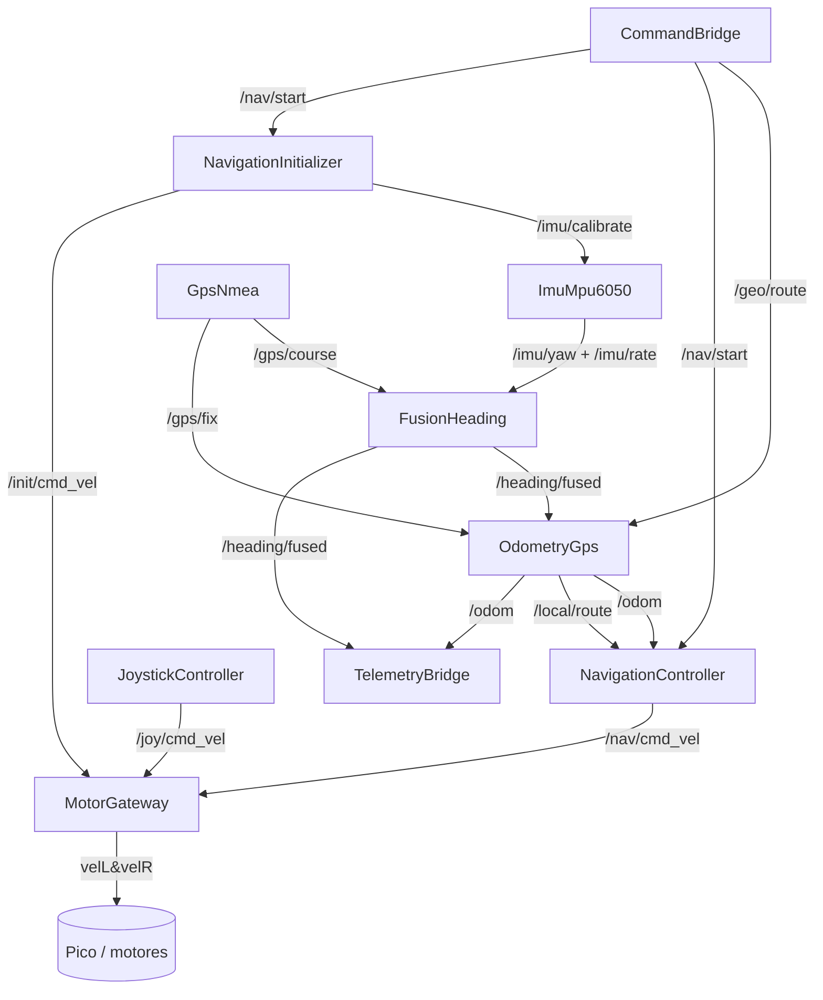

# Arquitectura — buey_robot

Navegacion autonoma de un skid-steer agricola (Buey V) en ROS2 Humble. Las reglas de diseño
(capas, nomenclatura, patrones) estan en [CONVENTIONS.md](CONVENTIONS.md); aca va el MAPA.

Principio: cada capa habla un vocabulario; la conversion lat/lon <-> x/y ocurre en UN solo
nodo (`OdometryGps`); arriba de esa frontera todo es x/y metrico.

## 1. Vista macro (capas)

```
┌──────────────────────────────────────────────────────────────────────┐
│ DRIVERS  (mundo fisico: lat/lon, yaw crudo)                            │
│   GpsNmea            ImuMpu6050                                        │
└──────────────────────────────────────────────────────────────────────┘
        │ /gps/fix /gps/course        │ /imu/yaw /imu/rate
        ▼                              ▼
┌──────────────────────────────────────────────────────────────────────┐
│ ESTIMACION  (angulo absoluto ENU)                                     │
│   FusionHeading  ── /heading/fused (solo al converger) ──▶            │
└──────────────────────────────────────────────────────────────────────┘
        ▼
┌──────────────────────────────────────────────────────────────────────┐
│ ODOMETRIA  ── FRONTERA geo <-> metrica (unico bilingue) ──            │
│   OdometryGps   (datum interno; lever-arm en x/y)                     │
│     /gps/fix + /heading/fused ─▶ /odom                                │
│     /geo/route (lat/lon)       ─▶ /local/route (x/y)                   │
└──────────────────────────────────────────────────────────────────────┘
        │ /odom  /local/route
        ▼
┌──────────────────────────────────────────────────────────────────────┐
│ NAVEGACION  (x/y puro)                                                 │
│   NavigationController   NavigationInitializer   JoystickController    │
│     ─▶ /nav/cmd_vel        ─▶ /init/cmd_vel        ─▶ /joy/cmd_vel     │
└──────────────────────────────────────────────────────────────────────┘
        ▼ (3 fuentes cmd_vel)
┌──────────────────────────────────────────────────────────────────────┐
│ ACTUACION                                                             │
│   MotorGateway  (mux prioridad + rampa por fuente + cinematica)  ─▶ motores │
└──────────────────────────────────────────────────────────────────────┘

┌──────────────────────────────────────────────────────────────────────┐
│ TRANSPORTE MQTT  (adapters/mqtt — unico lugar con paho)               │
│   CommandBridge   MQTT ─▶ ROS (/geo/route, /nav/start)                │
│   TelemetryBridge ROS ─▶ MQTT (telemetry/json, heading, odom, status) │
│   LogBridge       /rosout ─▶ MQTT (logs de todos los nodos)           │
└──────────────────────────────────────────────────────────────────────┘
```

## 2. Diagrama de flujo (mermaid)



## 3. Nodos (detalle)

| Archivo | Clase / nodo | Capa | Entra | Sale | Que hace |
|---------|--------------|------|-------|------|----------|
| `drivers/gps_nmea.py` | `GpsNmea` | driver | serial NMEA | `/gps/fix`, `/gps/course`, `/gps/status` | lee el GPS: lat/lon + calidad RTK; COG solo si confiable |
| `drivers/imu_mpu6050.py` | `ImuMpu6050` | driver | serial IMU, `/imu/calibrate` | `/imu/yaw`, `/imu/rate`, `/imu/status` | bias del gyro + integra yaw relativo |
| `fusion/heading.py` | `FusionHeading` | estimacion | `/imu/yaw`, `/imu/rate`, `/gps/course` | `/heading/fused` | fusiona gyro+COG -> yaw absoluto ENU; publica solo al converger |
| `odometry/gps.py` | `OdometryGps` | odometria (**bilingue**) | `/gps/fix`, `/heading/fused`, `/geo/route` | `/odom`, `/local/route` | fija el datum; fix -> /odom (lever-arm x/y + filtro, solo si confiable); ruta geo -> x/y |
| `navigation/controller.py` | `NavigationController` | navegacion | `/odom`, `/local/route`, `/nav/start` | `/nav/cmd_vel` | sigue la ruta (stop_and_turn, delega a `control/`); frena si /odom no fresco |
| `navigation/initializer.py` | `NavigationInitializer` | navegacion | `/nav/start`, `/odom`, `/imu/yaw`, `/heading/fused` | `/init/cmd_vel`, `/imu/calibrate` | en cada GO: recalibra gyro + avanza recto hasta converger el heading |
| `navigation/joystick.py` | `JoystickController` | navegacion | joystick (MQTT) | `/joy/cmd_vel` | teleop crudo, prioridad sobre nav |
| `motor/gateway.py` | `MotorGateway` | actuacion | `/nav/cmd_vel`, `/joy/cmd_vel`, `/init/cmd_vel` | motores (MQTT) | mux prioridad (joy>init>nav) + rampa por fuente + cinematica + clamp de rueda |
| `adapters/mqtt/command_bridge.py` | `CommandBridge` | transporte | MQTT waypoints/start | `/geo/route`, `/nav/start` | trae la ruta (lat/lon) y el GO de afuera; transporte puro |
| `adapters/mqtt/telemetry_bridge.py` | `TelemetryBridge` | transporte | `/odom`, `/heading/fused`, `/*/status` | MQTT web | espeja el estado del stack a la web |
| `adapters/mqtt/log_bridge.py` | `LogBridge` | transporte | `/rosout` | MQTT web | reenvia los logs de ROS (>= INFO) al broker |

**Notas:**
- `/odom` es contrato unico: hoy lo produce `OdometryGps` (outdoor); un `OdometryZed` (indoor) publicaria el mismo topic y el controller es agnostico.
- **Ausencia = invalido** en `/heading/fused`, `/odom`, `/gps/course`: el productor publica solo cuando el dato vale; el consumidor infiere por staleness.
- La ruta viaja como `std_msgs/String` con JSON `{waypoints:[...], loop}` (sin msg custom).
- El datum (lat/lon del primer fix) es **interno** a `OdometryGps`, no es topic.
- Contratos de topic: fuente unica en `buey_robot/contracts.py`.
